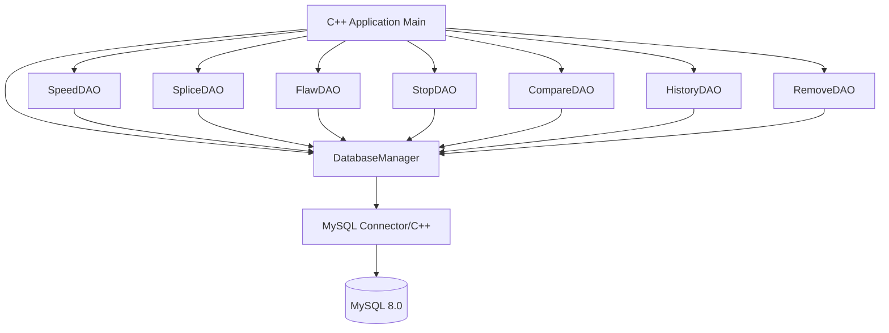
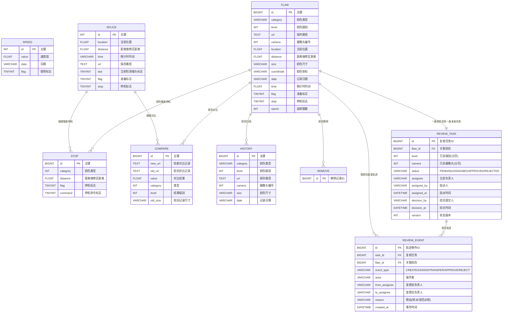

# 工业检测系统 - C++ MySQL 数据访问层

## 1. 系统架构

## 2. ER 图

> REVIEW_TASK 对 flaw_id 建唯一键（一条损伤不会同时进入多个人的待办），
> 并带 (assignee,status,id)、(level,id)、(camera,id)、(status,id) 复合索引支撑键集翻页；
> REVIEW_EVENT 为只追加表，CHECK 约束强制 TRANSFER/REJECT 必须携带非空理由。
> 结论提交使用 `UPDATE ... WHERE status='ASSIGNED' AND assignee=?` 条件更新，
> 并发提交在 InnoDB 行锁下只会有一条生效，零行结果再区分为 NOT_OWNER / ALREADY_DECIDED / TASK_NOT_FOUND。

## 3. 模块清单

| 模块 | 文件 | 职责 |
|------|------|------|
| DatabaseManager | db/DatabaseManager.h/.cpp | 连接池管理、SQL执行 |
| Entity | entity/*.h | 各表实体类定义 |
| DAO | dao/*.h/*.cpp | 各表CRUD操作；ReviewDAO 提供入队/指派/转派/条件结论与键集翻页 |
| Connection | db/DatabaseManager.h/.cpp | 独立会话连接，支持事务与多连接并发 |
| Logger | utils/Logger.h/.cpp | 日志记录 |
| Main | main.cpp | 入口与演示 |

## 4. 技术选型

- C++17
- MySQL Connector/C++ 8.0 (X DevAPI / Legacy C API)
- CMake 3.16+
- spdlog (日志，可选，本项目使用自实现轻量Logger)
