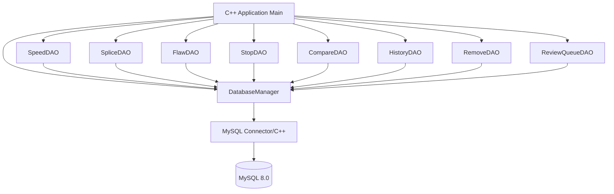
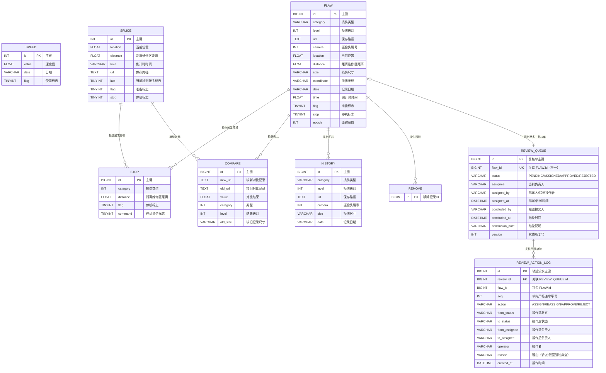

# 工业检测系统 - C++ MySQL 数据访问层

## 1. 系统架构

## 2. ER 图

## 3. 模块清单

| 模块 | 文件 | 职责 |
|------|------|------|
| DatabaseManager | db/DatabaseManager.h/.cpp | 连接池管理、SQL执行 |
| Entity | entity/*.h | 各表实体类定义 |
| DAO | dao/*.h/*.cpp | 各表CRUD操作 |
| Logger | utils/Logger.h/.cpp | 日志记录 |
| Main | main.cpp | 入口与演示 |

## 4. 技术选型

- C++17
- MySQL Connector/C++ 8.0 (X DevAPI / Legacy C API)
- CMake 3.16+
- spdlog (日志，可选，本项目使用自实现轻量Logger)
